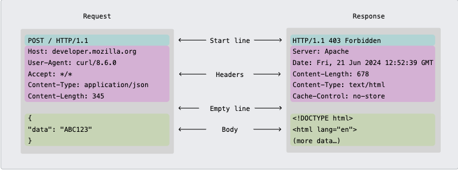
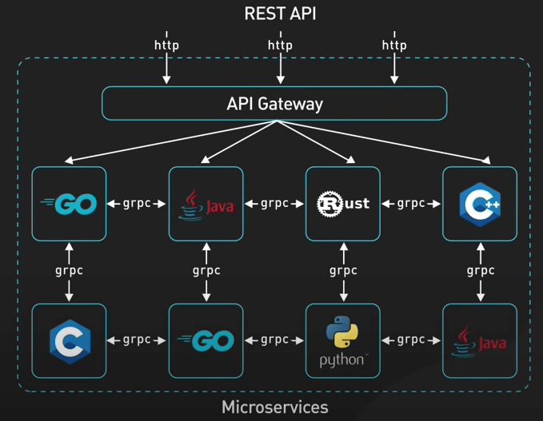
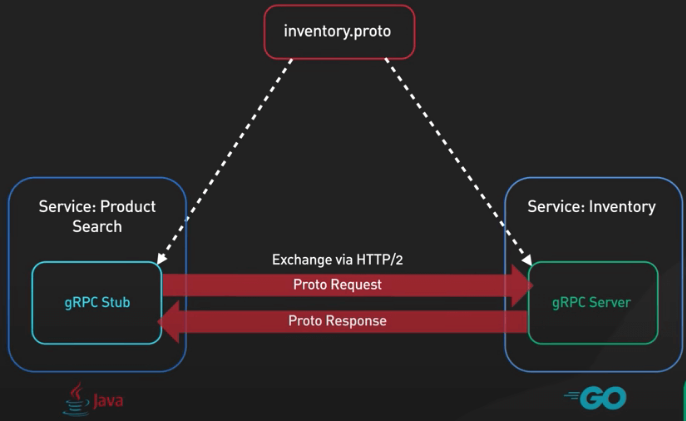
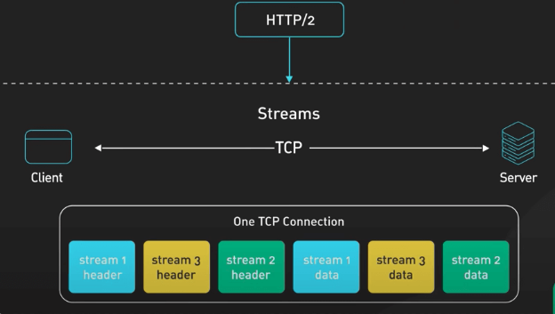

# Nội dung tìm hiểu cơ bản - HTTP

## 1.HTTP protocol

### 1.1. Basic

HTTP (Hyper Text Transfer Protocol) là 1 giao thức ứng dụng trong mô hình TCP/IP, dùng để trao đổi dữ liệu giữa client và server

Mô hình client-server: client (trình duyệt) gửi request, server trả về response

Stateless: mỗi request độc lập, không liên quan đến nhau, server ko nhớ trạng thái của request trước đó (muốn duy trì trạng thái cần sd cookie, session...)

Port mặc định: 80 (http), 443 (https)

### 1.2. Cấu trúc 1 request/response:
- Request line: GET /index.html... nếu là request
    
    Status line: HTTP/1.1 200 OK... nếu là response

- Headers: Host, User-Agent... cho request và Content-Type, COntent-Length... cho response

- Body: gồm nội dung gửi đi/ trả về



### 1.2. Phương thức của http

- GET: lấy dữ liệu từ server
- POST: gửi dữ liệu lên server
- PUT: cập nhật/thay thế toàn bộ resource
- PATCH: cập nhật một phần resource
- DELETE: xóa resource
- HEAD: giống GET nhưng không trả về body, chỉ lấy header (sd để kiểm tra resource tồn tại hoặc ktra metadata)
- OPTIONS: hỏi server xem resource hỗ trợ những method nào (dùng trong CORS)
- TRACE: ktra đường đi của request (thường bị disable vì lí do bảo mật)
- CONNECT: dùng để tạo tunnel

### 1.3. Status code

Nhóm 1xx - Information (Thông tin)
- 100 Continue – server chấp nhận header, client gửi tiếp body.
- 101 Switching Protocols – đổi giao thức (vd: HTTP → WebSocket).

Nhóm 2xx – Success (thành công)
- 200 OK – request thành công (trả dữ liệu).
- 201 Created – tạo mới thành công (vd: POST tạo resource).
- 202 Accepted – request được chấp nhận nhưng chưa xử lý xong.
- 204 No Content – thành công nhưng không có body trả về.

Nhóm 3xx – Redirection (chuyển hướng)
- 301 Moved Permanently – chuyển hướng vĩnh viễn.
- 302 Found – chuyển hướng tạm thời.
- 304 Not Modified – dữ liệu chưa thay đổi (dùng cache).

Nhóm 4xx – Client Error (lỗi phía client)
- 400 Bad Request – request sai cú pháp.
- 401 Unauthorized – chưa xác thực.
- 403 Forbidden – bị từ chối (có quyền auth nhưng không được phép).
- 404 Not Found – không tìm thấy resource.
- 405 Method Not Allowed – method không hỗ trợ.
- 409 Conflict – xung đột dữ liệu (vd: tạo trùng).
- 429 Too Many Requests – bị rate limit.

Nhóm 5xx – Server Error (lỗi phía server)
- 500 Internal Server Error – lỗi chung, không rõ chi tiết.
- 501 Not Implemented – server chưa hỗ trợ method.
- 502 Bad Gateway – gateway nhận phản hồi lỗi từ upstream.
- 503 Service Unavailable – server quá tải hoặc đang bảo trì.
- 504 Gateway Timeout – timeout khi proxy/gateway gọi upstream.

### 1.4. Header

Header là các cặp key-value đi kèm trong request/response, dùng để truyền thông tin bổ sung (metadata)

Request header (các header do request gửi lên server)
- Host: tên domain server (Host: example.com)
- User-Agent: thông tin client/trình duyệt (Mozilla/5.0...)
- Referer: URL trang trước đó
- Accept: kiểu dữ liệu có thể nhận (text/html, application/json)
- Accept-Language: ngôn ngữ ưu tiên (vi,en-US)
- Accept-Encoding: định dạng nén hỗ trợ (gzip, br)
- Authorization: token, basic auth... (Bearer <token>)
- Cookie: cookie gửi kèm

Request header liên quan đến nội dung body
- Content-Type: kiểu dữ liệu gửi (application/json, multipart/form-data)
- Content-Length: kích thước body (bytes)

Response headers (header trong response server trả về)
- Server: thông tin server (nginx/1.23)
- Date: thời gian server phản hồi
- Content-Type: kiểu dữ liệu trả về (application/json; charset=utf-8)
- Content-Length: độ dài nội dung
- Set-Cookie: gửi cookie về client
- Cache-Control: điều khiển cache (no-cache, max-age=3600)
- Location: dùng cho redirect (301, 302)
- Access-Control-Allow-Origin: dùng cho CORS (* hoặc domain cụ thể)

## 2. gRPC

### 2.1. Basic

gRPC (Google Remote Procedure Call) là một framework giao tiếp giữa các service do Google phát triển, chạy trên HTTP/2 và dùng Protocol Buffers để định nghĩa và truyền dữ liệu

Tìm hiểu chi tiết hơn về khái niệm gRPC: [Tại đây](https://viblo.asia/p/grpc-no-la-gi-va-co-nen-su-dung-hay-khong-gDVK2mAj5Lj)

RPC có thể được xem là một giao thức request-respone thông thường tuy nhiên nó được dùng cho việc giao tiếp giữa các server với nhau (server-server) nhiều hơn là client-server.

Việc giao tiếp server-server có ý nghĩa quan trọng trong các hệ thống phân tán (distributed system) như Microservice vì cần có một phương pháp để tăng tải và thông lượng giữa các services

Protocol Buffer là cơ chế không phụ thuộc vào ngôn ngữ và nền tảng để mã hóa dữ liệu có cấu trúc. gRPC sử dụng Protocol Buffer để mã hóa và gửi dữ liệu như bthg


Tìm hiểu thêm về kiến trúc gRPC: [Tại đây](https://system.farmerboy95.com/ByteByteGo/grpc/)



### 2.2. Kiến trúc 

gRPC có 3 layer

```bash
Application Layer  (Service code, business logic)
└── gRPC Layer     (Stub, Channel, Protobuf, RPC mechanism)
    └── HTTP/2     (Multiplexing, Flow control, Header compression, TLS)
        └── TCP/UDP (QUIC nếu gRPC-web)
```

### 2.3. Thành phần



#### a, .proto file (protocol buffer)

Là nơi định nghĩa contract giữa client <-> server

Gồm:
- message: định nghĩa dữ liệu
- service: định nghĩa RPC method

```
syntax = "proto3";

message HelloRequest {
  string name = 1; // field number
}

message HelloReply {
  string message = 1;
}

service Greeter {
  rpc SayHello (HelloRequest) returns (HelloReply);
}
```

#### b, Code generation

Thành phần này dùng protoc để generate stub code cho client và server
- Stub là một proxy object của client giúp gọi method như gọi hàm ở local

- Server implement interface tương ứng, xử lý logic và trả kết quả

#### c, Channel và Stub

Channel là kết nối từ client -> server bằng giao thức HTTP/2

Stub đã định nghĩa ở trên, được auto generate từ file .proto

### 2.4. Cấu trúc gói tin gRPC dựa trên HTTP/2 

```
+---------------+---------------------+
| Length (4B)   | Flag (1B) | Message |
+---------------+---------------------+
```

- Length (4 bit): độ dài message
- Flag (1 bit): 0 (normal), 1 (compressed)
- Message: dữ liệu đã được chuẩn hóa qua Protobuf

### 2.5. Các kiểu giao tiếp trong gRPC

Unary RPC:
- Giống REST API - client gửi 1 request, server trả về 1 response

Server Streaming RPC:
- Client gửi 1 request, nhưng server trả về 1 luồng (stream) nhiều response

Client Streaming RPC:
- CLient gửi nhiều request, server xử lý và trả về 1 response

Bidirectional Streaming RPC:
- Cả client và server đều stream nhiều message song song, độc lập



## 3. So sánh HTTP và gRPC

### 3.1. Về giao thức và cơ chế

| Tiêu chí          | HTTP (REST)                 | gRPC                                    |
| ----------------- | --------------------------- | --------------------------------------- |
| Transport         | HTTP/1.1 (hoặc HTTP/2)      | HTTP/2 (mặc định), hỗ trợ streaming tốt |
| Định dạng dữ liệu | JSON (text-based, nặng hơn) | Protobuf (binary, nhẹ, nhanh)           |
| Kiểu gọi          | Resource-based (URL, CRUD)  | RPC-based (gọi hàm trực tiếp)           |

### 3.2. Hiệu năng

| HTTP (REST)                                                   | gRPC                                                              |
| ------------------------------------------------------------- | ----------------------------------------------------------------- |
| JSON → parse/chuyển đổi chậm hơn                              | Protobuf → binary, nhỏ gọn, tốc độ cao                            |
| HTTP/1.1 → mỗi request cần 1 TCP connection (hoặc keep-alive) | HTTP/2 → multiplexing, 1 connection xử lý nhiều request song song |
| Payload lớn (verbose)                                         | Payload nhỏ (compact)                                             |

### 3.3. Kiểu giao tiếp

HTTP (hay REST API nói chung) chỉ sd 1-1 giữa request-response

gRPC hỗ trợ 4 kiểu giao tiếp:
- 1-1
- 1-N
- N-1
- N-N

### 3.4. Debug

| HTTP (REST)                            | gRPC                                     |
| -------------------------------------- | ---------------------------------------- |
| Dễ debug (cURL, Postman)               | Khó debug hơn (cần grpcurl, BloomRPC...) |
| Dễ đọc vì JSON = text-based            | Protobuf = binary, khó đọc thủ công      |
| API schema thường bằng OpenAPI/Swagger | Schema chặt chẽ bằng `.proto` file       |

### 3.5. Bảo mật

Cả 2 đều hỗ trợ TLS:
- REST sử dụng JWT, OAuth2
- gRPC sử dụng TLS + token-based auth và cả mTLS

## 4. Implement socket communication

Socket = cổng giao tiếp giữa hai tiến trình (process), thường qua mạng

Trong TCP socket, có 2 vai trò chính:
- Server: tạo socket, bind vào IP + port, listen và accept kết nối từ client
- Client: tạo socket, connect tới IP + port của server

### 4.1. Implement socket với Python

### 4.2. Implement socket với C++
