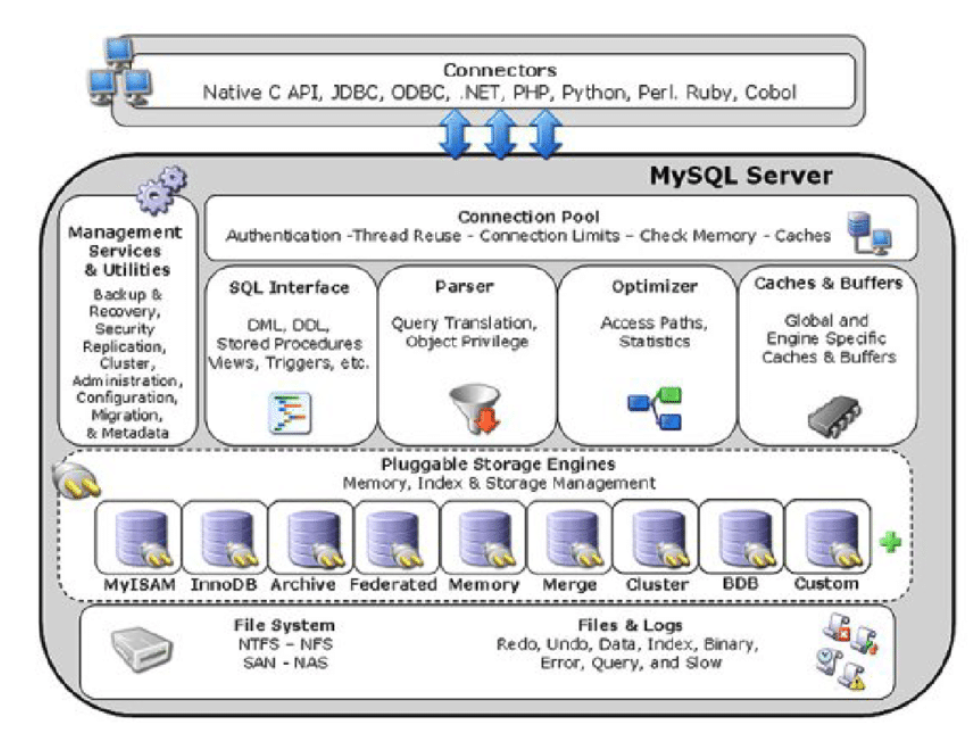

# Nội dung tìm hiểu cơ bản - MySQL

## 1. Tổng quan

MySQL là hệ quản trị cơ sở dữ liệu quan hệ mã nguồn mở, hỗ trợ nhiều storage engines, JSON, GIS, plugin. 



## 2. Install MySQL

Cài MySQL 8.0 từ RPM package

```bash
dnf install mysql-server
```

Với mysql 8.4 cần chỉ rõ server profile

```bash
dnf module install mysql:8.4/server
```

Chạy mysqld service 

```bash
systemctl start mysqld.service
```

Enable mysqld

```bash
systemctl enable mysqld.service
```

Recommend: để tăng cường bào mật khi cài mysql, chạy lệnh

```bash
mysql_secure_installation
```

Lệnh này sẽ khởi chạy một tập lệnh tương tác hoàn toàn, nhắc nhở bạn thực hiện từng bước trong quy trình.

Tập lệnh này cho phép bạn cải thiện bảo mật theo những cách sau:

- Thiết lập mật khẩu cho tài khoản root
- Xóa người dùng ẩn danh
- Không cho phép đăng nhập root từ xa (bên ngoài máy chủ cục bộ)

## 3. Chạy nhiều version MySQL bằng container

Cần đăng nhập vào registry trước

```bash
podman login registry.redhat.io
```

Chạy mysql 8.0 trong container

```bash
podman run -d --name <container_name> -e MYSQL_ROOT_PASSWORD=<mysql_root_password> -p <host_port_1>:3306 rhel9/mysql-80
```

Chạy mysql 8.4 trong container

```bash
podman run -d --name <container_name> -e MYSQL_ROOT_PASSWORD=<mysql_root_password> -p <host_port_2>:3306 rhel9/mysql-84
```

Để đảm bảo client có thể truy cập vào database server, cần mở firewall cho các port

```bash
firewall-cmd --permanent --add-port={<host_port_1>/tcp,<host_port_2>/tcp,<host_port_3>/tcp,<host_port_4>/tcp,...}

firewall-cmd --reload
```

Để truy cập vào các mysql server

```bash
# liệt kê các pod
podman ps

# exec vào pod
podman exec -it <name> -- /bin/bash

# đăng nhập as root
mysql -u root -p -h localhost -P <host_port> --protocol tcp
```

## 4. Cấu hình MySQL

Để cấu hình mysql trên máy host, ta sửa file config của dịch vụ mysqld ở vị trí

```bash
/etc/my.cnf.d/mysql-server.cnf
```

Một số config phổ biến

- bind-address- là địa chỉ mà máy chủ lắng nghe. Các tùy chọn có thể là:
    - tên máy chủ
    - một địa chỉ IPv4
    - một địa chỉ IPv6
- skip-networking- kiểm soát việc máy chủ có lắng nghe các kết nối TCP/IP hay không. Các giá trị có thể là:
    - 0 - để lắng nghe tất cả các khách hàng
    - 1 - chỉ lắng nghe khách hàng địa phương
- port- cổng mà MySQL lắng nghe các kết nối TCP/IP.

Sau khi sửa file, lưu lại và restart mysqld

```bash
systemctl restart mysqld.service
```

## 5. Thiết lập mã hóa TLS trên MySQL server

Trước khi có thể bật mã hóa TLS trên máy chủ MySQL, cần có các file sau trên mysql server
- cert của cơ quan cấp chứng chỉ (CA)
- server cert
- private key trên máy chủ MySQL

### a. Chuẩn bị các CA và cert

Lưu các cert và key cần thiết vào thư mục

```bash
# Server certificate
mv <path>/server.example.com.crt.pem /etc/pki/tls/certs/

# Certificate Authority (CA) certificate
mv <path>/ca.crt.pem /etc/pki/tls/certs/
```

Set quyền của các file cert về read write

```bash
chmod 644 /etc/pki/tls/certs/server.example.com.crt.pem /etc/pki/tls/certs/ca.crt.pem
```

Để file private key vào folder

```bash
mv <path>/server.example.com.key.pem /etc/pki/tls/private/
```

Set quyền cho private key

```bash
chmod 640 /etc/pki/tls/private/server.example.com.key.pem

chgrp mysql /etc/pki/tls/private/server.example.com.key.pem
```

Đổi SELinux context:

```bash
restorecon -Rv /etc/pki/tls/
```

### b. Cấu hình sử dụng TLS

Yêu cầu:
- Đã cài MySQL server
- mysqld đang running
- Các file cert và PEM đã tồn tại trên server và readable bởi user mysql
- Distinguished name (DN) hoặc subject alternative name (SAN) khớp với team

Tạo file /etc/my.cnf.d/mysql-server-tls.cnf và thêm nội dung

```bash
[mysqld]
ssl_key = /etc/pki/tls/private/server.example.com.key.pem
ssl_cert = /etc/pki/tls/certs/server.example.com.crt.pem
ssl_ca = /etc/pki/tls/certs/ca.crt.pem
```

Nếu có Certificate Revocation List (CRL) thì thêm dòng

```bash
ssl_crl = /etc/pki/tls/certs/example.crl.pem
```

Optional: Từ chối các kết nối ko mã hóa

```bash
require_secure_transport = on
```

Optional: Cài đặt TLS version mà server hỗ trợ

```bash
tls_version = TLSv1.3
```

Restart mysqld

```bash
systemctl restart mysqld.service
```

## 6. Xác nhận

Để đơn giản hóa trouble shooting, thực hiện 1 số bước trên MySQL server trước khi cấu hình local client sử dụng mã hóa TLS

Xác nhận MySQL đã enable mã hóa TLS

```bash
mysql -u root -p -h <MySQL_server_hostname> -e "SHOW session status LIKE 'Ssl_cipher';"
```

Nếu bạn cấu hình MySQL chỉ hỗ trợ 1 số version TLS cố định

```bash
mysql -u root -p -e "SHOW GLOBAL VARIABLES LIKE 'tls_version';"
```

Xác minh server sử dụng chính xác CA cert, server cert và private key

```bash
mysql -u root -e "SHOW GLOBAL VARIABLES WHERE Variable_name REGEXP '^ssl_ca|^ssl_cert|^ssl_key';"
```

