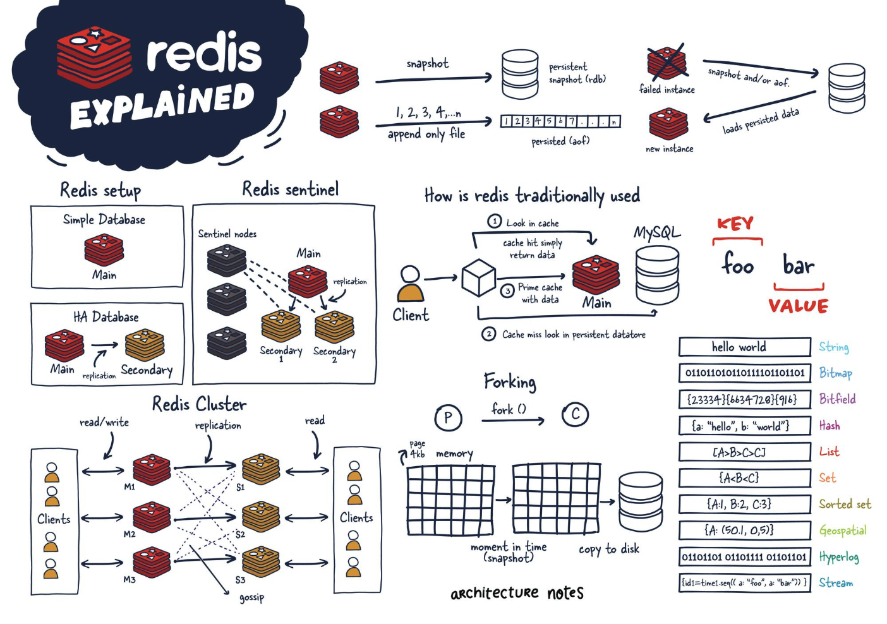

# Nội dung tìm hiểu cơ bản - Redis

## 1. Tổng quan

Redis là một kho dữ liệu in-memory, hỗ trợ key-value, các cấu trúc dữ liệu phong phú (strings, lists, sets, sorted sets, hashes, bitmaps, hyperloglogs, streams, …).

Được dùng nhiều làm cache, message broker, session storage, queue, real-time data, v.v.

Vì dữ liệu nằm trong RAM nên tốc độ rất cao, nhưng cũng cần quan tâm đến persistence (nếu cần dữ liệu không mất), memory management và bảo mật nếu mở mạng.



## 2. Install Redis

Tải package redis về server

```bash
yum install redis
```

Chạy redis service

```bash
systemctl start redis

systemctl enable redis
```

Check phiên bản của redis server để confirm đã cài đặt

```bash
redis-server -v
```

Thử test redis-cli

```bash
# redis-cli 
127.0.0.1:6379> ping
PONG
```

## 3. Cấu hình redis cho phép kết nối từ xa

Enable Redis server để lắng nghe trên tất cả các network interface thay vì chỉ loopback interface 127.0.0.1

Để làm vậy, sửa file /etc/redis.conf như sau

```bash
# comment dòng 127.0.0.1 trong file
bind 127.0.0.1 ::1

# Disable protect mode yes -> no
protected-mode no
```

Sau đó restart redis

```bash
systemctl restart redis-server
```

Cấu hình mở port firewall cho Redis traffic

```bash
firewall-cmd --zone=public --permanent --add-service=redis

firewall-cmd --reload
```

Thử kết nối redis từ remote host

```bash
# kết nối
redis-cli -h REDISHOSTNAME_OR_IPADDRESS

# trong interactive, ktra version
rhel8-redis:6379> INFO
redis_version:4.0.10
```
