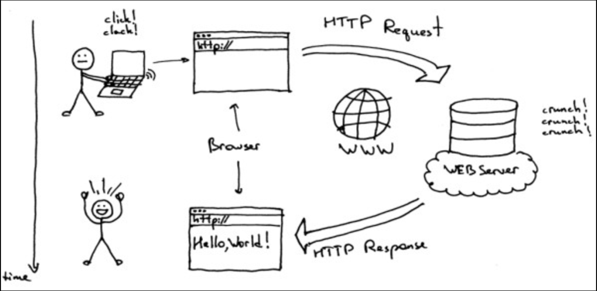
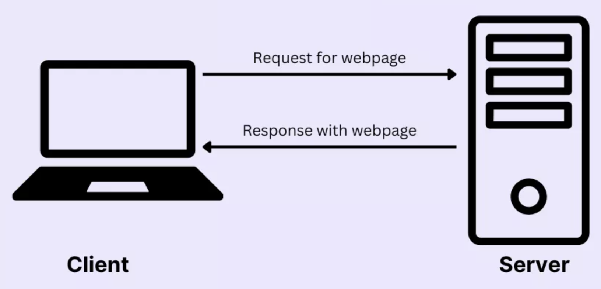

# Kiến thức cơ bản - Webserver

## 1. Basic

Webserver là phần mềm (và phần cứng) nhận các HTTP/HTTPS request và trả về HTTP response



Webserver thường là các nhiệm vụ:
- Trả về trang web tĩnh 
- Chuyển tiếp yêu cầu đến dịch vụ phía sau
- Trả về API response

Client-Server model



Proxy là một máy chủ trung gian đứng giữa client và server, nhận các request và chuyển tiếp chúng đến đích

```
Client  --->  Proxy  --->  Server
Client  <---  Proxy  <---  Server
```

Proxy server có 2 loại:
- Forward Proxy: client biết mình đang sd proxy, proxy đại diện cho client đi ra ngoài Internet giúp ẩn IP cho client
- Reverse Proxy: client chỉ biết giao tiếp với Reverse Proxy, các công việc xử lý và backend đằng sau bị ẩn

## 2. Webserver - Apache

### 2.1. Basic

Apache HTTP server (httpd trên CentOS/RHEL) là một webserver mã nguồn mở

Sử dụng client-server model:
- Client gửi request
- Apache nhận reqquest, xử lý hoặc forward rồi trả về HTTP response

### 2.2. Kiến trúc

#### a, Apache core

httpd daemon: tiến trình quản lý worker process/thread

Multi-Processing Module (MPM): 3 module
- prefork: mỗi request = 1 process (ổn định, hợp CGI, nhưng tốn RAM)
- worker: dùng threads (nhẹ hơn)
- event: cải tiến worker, tối ưu cho keep-alive & high concurrency

#### b, Modules

Các module định nghĩa cách hoạt động của Apache

Vài module phổ biến:
- mod_core → cốt lõi, xử lý request.
- mod_ssl → bật HTTPS (TLS/SSL).
- mod_proxy → làm proxy/reverse proxy.
- mod_rewrite → rewrite URL.
- mod_headers → chỉnh HTTP headers.
- mod_status → theo dõi trạng thái server.
- mod_auth_basic, mod_auth_digest → xác thực.
- mod_php, mod_wsgi, mod_perl → nhúng ngôn ngữ lập trình.

#### c, File config

File chính: /etc/httpd/conf/httpd.conf (RHEL)

Folder gồm các file bổ sung config phụ: /etc/httpd/conf.d/

Module config: /etc/httpd/conf.modules.d/

Các permission rule, selinux trên file/folder và port

### 2.3. Cài đặt và cấu hình cơ bản

Cài đặt
```
dnf install httpd

systemctl enable --now httpd
```

Cấu hình file/folder, port hoặc firewall cần thiết

```
firewall-cmd --permanent --add-port=80/tcp
firewall-cmd --reload
```

Có thể thêm các HTML file vào thư mục /var/www/html/ để Apache có thể truy cập

```
http://<server-ip>/index.html
```

### 2.4. Cấu hình Virtual Host trên Apache

Virtual Host cho phép Apache chạy nhiều website trên cùng 1 server (1 ip hoặc nhiều ip)

Có 2 loại:
- Name-based virtual host: phân biệt website theo tên miền
- IP-based virtual host: phân biệt website theo IP

Ví dụ có 2 website:
- example1.com -> /var/www/exmaple1
- example2.com -> /var/www/example2

**Các bước thực hiện**

Tạo folder riêng cho từng miền trong folder /var/wwww/ và thêm các file html
```
/var/www/exmaple1
/var/www/exmaple2
```

Cấp quyền và context phù hợp

Tạo file cấu hình trong /etc/httpd/conf.d/
```
/etc/httpd/conf.d/example1.com.conf
/etc/httpd/conf.d/example2.com.conf
```

Thêm nội dung sau vào file cấu hình:
```bash
<VirtualHost *:80> # lắng nhghe trên cổng 80
    ServerAdmin admin@example1.com # email của admin
    ServerName example1.com # domain
    ServerAlias www.example1.com # tên miền bổ sung
    DocumentRoot /var/www/example1.com/public_html # thư mục gốc
    ErrorLog /var/www/example1.com/error.log # nơi lưu error log
    CustomLog /var/www/example1.com/access.log combined # nơi lưu log hoạt động
</VirtualHost>
```

Tương tự với miền còn lại, thay số 1 -> 2

Restart dịch vụ httpd
```
systemctl restart httpd
```

**Disable virtual host**

Để disable chỉ cần sửa tên file config không khớp với tên miền nữa
```
/etc/httpd/conf.d/example2.com.conf

-> /etc/httpd/conf.d/disable_example2.com.conf
```

### 2.5. Cấu hình xác thực bằng Kerberos cho Apache

Khi cấu hình xác thực bằng Kerberos, Apache ủy thác việc xác thực cho Kerberos server và sẽ ko ktra username/password nữa, chỉ kiểm tra Kerberos ticket

Lợi ích:
- User chỉ nhập user/pass 1 lần duy nhất khi login domain
    
    -> Trải nghiệm người dùng mượt hơn

- Bảo mật cao (ko gửi plaintext password qua mạng và ticket được mã hóa bằng key của KDC)

- Hoạt động tốt với Active Directory (Window) hoặc FreeIPA/IdM (Linux)

- Hỗ trợ SSO xuyên tầng: ví dụ user vào webapp Apache, webapp có thể thay mặt user truy cập DB hoặc dịch vụ khác mà không cần password

#### a, Setup GSS-Proxy trong môi trường IdM

GSS-proxy là một daemon service chạy trên Linux, dùng để quản lý và ủy quyền sd credentials Kerberos cho các ứng dụng

GSS-proxy đóng vai trò trung gian giữa Apache và GSS API/ Kerberos library

IdM là hệ thống quản lý danh tính (user, group, quyền auth) tập trung cho cả tổ chức

**Thực hiện setup**

B1: Trên Kerberos server, đăng ký service principal trong Kerberos realm
```
ipa service-add HTTP/example1.com@EXAMPLE1.COM
```

B2: Trên apache server, yêu cầu IdM server cấp keytab cho service
```
ipa-getkeytab -s $(awk '/^server =/ {print $3}' /etc/ipa/default.conf) \
  -k /etc/gssproxy/http.keytab \
  -p HTTP/$(hostname -f)
```

Keytab được lưu tại /etc/gssproxy/http.keytab với quyền mặc định là 400

B3: Cấu hình GSS-proxy cho apache

Tạo file cấu hình /etc/gssproxy/80-httpd.conf với nội dung:
```bash
[service/HTTP]
  mechs = krb5 # dùng Kerberos
  cred_store = keytab:/etc/gssproxy/http.keytab # chỉ định keytab
  cred_store = ccache:/var/lib/gssproxy/clients/krb5cc_%U # chỉ định credential cache
  euid = apache # cho phép user apache (process httpd) dùng keytab thông quan gss-proxy
```

B4: Chạy lại GSS-proxy
```
systemctl restart gssproxy.service
systemctl enable --now gssproxy.service
```

#### b, Cấu hình Kerberos auth cho thư mục /var/www/html/private/ trên Apache

Điều kiện:
- Apache server đã cài mod_auth_gssapi và gssproxy đang chạy
- Kerberos server có service principal HTTP/<APACHE_FQDN> và cấp keytab cho apache

B1: Cấu hình Apache để bảo về thư mục riêng tư

Mở file cấu hình apache hoặc tạo file .conf mới trong /etc/http/conf.d/ với nội dung:
```
<Location /var/www/html/private>
  AuthType GSSAPI
  AuthName "GSSAPI Login"
  Require valid-user
</Location>
```

B2: Cho phép apache dùng GSS proxy

Cấu hình httpd service
```bash
systemctl edit httpd.service

# thêm dòng sau
[Service]
Environment=GSS_USE_PROXY=1
```

B3: Reload dịch vụ
```
systemctl daemon-reload
systemctl restart httpd.service
```

### 2.6. Cấu hình TLS cho Apache server

TLS encryption = Transport Layer Security là chuẩn bảo mật cho việc mã hoá kết nối giữa client và server.

TLS dùng để:
- Mã hóa dữ liệu trong các gói tin truyền đi
- Xác minh danh tính server (và cả client) thông qua chứng chỉ số
- Đảm bảo tính toàn vẹn dữ liệu (ko bị chỉnh sửa trong khi truyền)

TLS

#### a, Thực hiện cấu hình TLS cho Apache

Đkien:
- Có sẵn private key
- Có sẵn TLS cert do CA cấp
- Có CA Certificate
- DNS đã trỏ về IP của server
- Apache đang chạy

B1: Cài đặt module SSL
```
dnf install -y mod_ssl
```

B2: Cấu hình file /etc/httpd/conf.d/ssl.conf và tìm đến đoạn có \<VirtualHost _default_:443>

```bash
# Sửa server name cho khớp với 'Common Name' trong certificate
ServerName example.com

# Optional: nếu cert có additional hostname thì thêm vào Alias
ServerAlias www.example.com server.example.com

# Thêm đường dẫn của các file cert trên server
SSLCertificateKeyFile "/etc/pki/tls/private/example.com.key"
SSLCertificateFile "/etc/pki/tls/certs/example.com.crt"
SSLCACertificateFile "/etc/pki/tls/certs/ca.crt"
```

Chú ý cấu hình các file key và cert để chỉ root mới có quyền truy cập
```
chown root:root /etc/pki/tls/private/example.com.key
chmod 600 /etc/pki/tls/private/example.com.key
```

B3: Restart Apache
```
systemctl restart httpd.service
```

#### b, Cấu hình các phiên bản TLS được hỗ trợ trên Apache

Điều kiện:
- TLS encryption đang bật trên Apache server như ở phần trước

**Thực hiện**

B1: Sửa file /etc/httpd/conf/httd.conf, tìm đoạn \<VirtualHost _default_:443> hay bất cứ đoạn nào muốn cấu hình và thêm nội dung
```
SSLProtocol -All TLSv1.3
```

B2: Restart dịch vụ

#### c, Cấu hình các loại mã hóa được hỗ trợ

Điều kiện:
- Mã hóa TLS được bật trên Apache server

**Thực hiện**

B1: Cũng tìm đoạn \<VirtualHosst> muốn cấu hình và thêm dòng sau
```bash
SSLCipherSuite "AES256+EDH:!SHA1:!SHA256"
# cho phép mã hóa AES256+EDH
# vô hiệu hóa các mã hóa sử dụng SHA1 và SHA256
```

B2: Restart dịch vụ

### 2.7. Cấu hình xác thực chứng chỉ TLS cho client

Xác thực chứng chỉ TLS cho client cho phép admin chỉ cho phép những user xác thực bằng chứng chỉ mới được truy cập tàu nguyên trên server

**Thực hiện**

B1: Sửa file /etc/httpd/conf/httpd.conf và thêm dòng sau vào mục \<VirtualHost> cần sửa:
```
<Directory "/var/www/html/Example/">
  SSLVerifyClient require
</Directory>
```

Cấu hình này định nghĩa rằng server phải validate cert của client trước khi cho client truy cập nội dung trong folder /var/www/html/Example/

B2: Restart dịch vụ

### 2.8. Triển khai tường lửa dựa trên ModSecurity

ModSecurity đóng vai trò như một WAF (Web Application Firewall) tích hợp với apache 

Lọi ích:
- Tăng cường bảo mật
- Chống tấn công web
- Phát hiện và ghi lại một số request khả nghi

**Thực hiện**

B1: Cài đặt các package cần thiết
```
dnf install -y mod_security mod_security_crs httpd
```

B2: Restart httpd

**Thêm các quy tắc custom vào ModSecurity**

B1: Sửa file /etc/httpd/conf.d/mod_security.conf và thêm nội dung sau vào dòng bắt đầu bằng "SecRuleEngine On"
```
SecRule ARGS:data "@contains evil" "deny,status:403,msg:'param data contains evil data',id:1"
```

B2: Restart httpd

### 2.9. làm việc với Apache module


## 3. Webserver - Nginx

## 4. Loadbalancing - HAProxy


## 5. High Availability (Failover & Virtual IP)